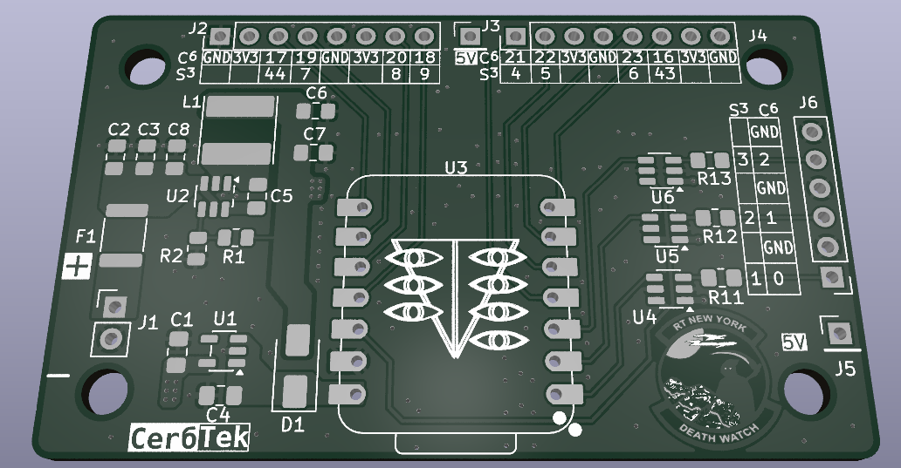

# XiaoCarrierARGB

Adressable RGB carrier board for Seeed Xiao Esp32 modules, deisgned for c6 or s3 variants. Input voltage designed to be 12-24V and has an back current protection mechanism to allow the Xiao to be connected to a pc while the board is powered from elsewhere. 
- NOTE the 5v level shifters needed for the RGB data signalling are only powered from the 12-24v input and only connecting the xiao to power will not allow for RGB strip control. 
---
## Features

- 3 Dedicated 5V levelshifted outputs for LED strip data lines
- 8 GPIO breakouts capable of all features the selected Xiao is capable of including
  - SPI
  - I2C
  - Analog inputs
  - UART
- optional pull up/down resistors for GPIO breakouts can be pulled to:
  - 5V
  - 3.3V
  - GND
- 1.5 Amps of 5V output
- 1 Amp of 3.3V output

---

## USER INFO

### BoM
[Interactive Bill of Materials](https://sovietmagician.github.io/XiaoCarrierARGB/bom/ibom.html "IBOM")
Component Manufacturer Part Numbers are included for ICs and certain passives with critical values. In addition Digikey and LCSC(chinese) part distributor numbers are included in the BoM as well. The part numbers for passives have been left blank as an excercise for the reader. Note for C2 C3 C8, __these capacitors must be rated to 30V at a minimum__.
### Notes about componet placement/population
The following components are NOT OPTIONAL
- C2 C3 C5 C6 C7
  - These capacitors are necessary for the operation of the buck converter a provisional value of 22µF was selected but it is possible more may be necessary
- C5
  - Bootstrap capacitor should be 100nF

- L1
  - The main inductor for the buck converter without it it just wont function at all
- D1
  - Needed to allow the Xiao to be both plugged in to a computer and have its primary input voltage connected
- U2
  - The buck converter IC without it it will not accept 12-24V input and the level shifters will not be able to drive the RGB data lines
- R1 R2
  - Feedback resistors to allow the buck to actually regulate to the correct (5) Voltage. These must be populated at the right values in the right spots, R1-110kΩ R2-15kΩ

The following components are highly recommended
- U1 
  - The LDO for the 3.3V pins on the GPIO breakout, while not STRICTLY necessary it is highly recommended 
- C1 C4
  - These 1µF capacitors are necessary for 3.3V LDO functionality to supply power to the power pins accompanying the GPIO breakouts A higher value may be used but the total capacitance on this line MAY NOT exceed 10µF to keep the Xiao's VBUS pin inline with USB spec
- F1
  - Input protection to prevent the board from drawing too much current, should save the board in the event of shorts or overcurrent events
- U4 U5 U6
  - these are the level shifters to drive the LED strips, not all need to be populated but populating none is kind of silly 
- C8
  - A good decoupling cap of 100nF is nice to have and since the previous 100nF cap is necessary theres no real reason not to populate it 
  
The following are strictly optional
- R3-R10
  - these are pull up/down resistors meant to allow for ease of use of the GPIO breakouts some communication busses need pull ups or pull downs and its just usecase dependant
- R11-13
  - these are series resistors meant to minimize reflections in the even of exceptionally long data line runs(ie there is a very long wire between the board and the first IC on the LED strip) can be subbed for 0Ω resistors or pads can be bridged with solder or wire